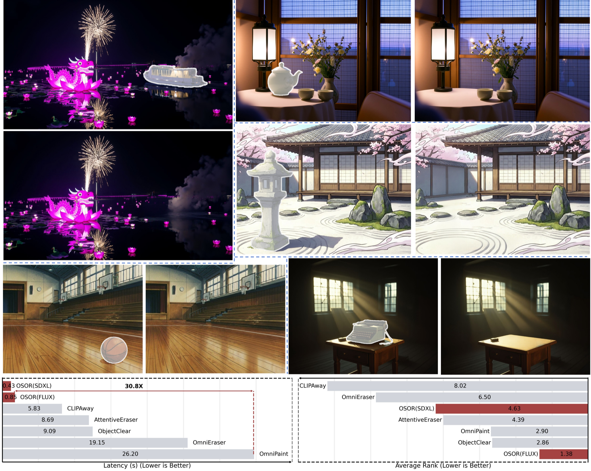

<h1 align="center">OSOR: One-Step Diffusion Inpainting for Effect-Aware Object Removal</h1>

<p align="center">
  <strong>ECCV 2026</strong>
</p>

<p align="center">
  Qinming Zhou<sup>1,2,*</sup>,
  Chenxi Sun<sup>1,3,*</sup>,
  Deyang Kong<sup>1,3</sup>,
  Junhao He<sup>1</sup>,
  Xiangheng Tang<sup>1,4</sup>,
  Peike Yu<sup>1,5</sup>,
  Haotian Wu<sup>1</sup>,
  Leilei Cao<sup>6</sup>,
  Linfeng Zhang<sup>1</sup>
</p>

<p align="center">
  <sup>1</sup>Shanghai Jiao Tong University,
  <sup>2</sup>Tsinghua University,
  <sup>3</sup>University of Electronic Science and Technology of China,
  <sup>4</sup>Xidian University,
  <sup>5</sup>Tongji University,
  <sup>6</sup>Transsion
</p>

<p align="center">
  <a href="https://zhouqm-git.github.io/osor/"></a>
  <a href="https://arxiv.org/abs/2606.28094"></a>
  <a href="https://huggingface.co/QinmingZhou/OSOR"></a>
  <a href="https://modelscope.cn/datasets/ZhouqmR/CORNE"></a>
  <a href="https://huggingface.co/datasets/QinmingZhou/CORNE-Val"></a>
  <a href="https://huggingface.co/datasets/QinmingZhou/AnimeEraseBench"></a>
  <a href="https://huggingface.co/datasets/QinmingZhou/TextEraseBench"></a>
</p>

OSOR is a one-step diffusion framework for efficient, effect-aware, and mask-robust object removal. It removes both the target object and object-associated effects such as shadows, reflections, and residual traces, while running in a single denoising step.



## Abstract

Real-world object removal is challenging due to two key difficulties: the target object's non-local effects, such as shadows and reflections, which are difficult to model, and the fact that user-provided masks are often inaccurate or incomplete. With billions of parameters and tens of denoising steps, diffusion-based models achieve strong removal performance at the expense of substantial computational cost, limiting their use in interactive applications and on edge devices. To address these challenges, we present **OSOR** (One-Step Object Removal), which simultaneously achieves efficient, effect-aware, and mask-robust object removal. Concretely, OSOR introduces: (1) an occupancy-guided discriminator for precise boundary supervision, enabling stable single-step diffusion training; (2) an alpha head that leverages knowledge from pretrained diffusion models to predict appropriate removal regions with minimal overhead, thereby handling imperfect masks; and (3) a semantic-anchored verification pipeline (SAVP) that filters noisy instruction-based triplets to produce effect-aware supervision at scale. Using SAVP, we curate **CORNE**, which contains 280K verified removal pairs, and further annotate AnimeEraseBench and TextEraseBench to evaluate performance on more complex removal tasks. Experiments show that OSOR surpasses strong multi-step diffusion baselines in perceptual quality while achieving 4x to 30x faster inference.

## News

- **2026.06**: OSOR is available on [arXiv](https://arxiv.org/abs/2606.28094).
- **2026.06**: We release the open-source code, model weights, CORNE training data, and three evaluation benchmarks.

## Release

- **Code**: SAVP, OSOR-FLUX-Fill, and OSOR-SDXL-Inpainting are released in this repository.
- **Paper**: [arXiv:2606.28094](https://arxiv.org/abs/2606.28094).
- **Training data**: [CORNE](https://modelscope.cn/datasets/ZhouqmR/CORNE) on ModelScope.
- **Benchmarks**: [CORNE-Val](https://huggingface.co/datasets/QinmingZhou/CORNE-Val), [AnimeEraseBench](https://huggingface.co/datasets/QinmingZhou/AnimeEraseBench), and [TextEraseBench](https://huggingface.co/datasets/QinmingZhou/TextEraseBench) on Hugging Face.
- **Model weights**: [QinmingZhou/OSOR](https://huggingface.co/QinmingZhou/OSOR) on Hugging Face.

## Resources

| Resource | Link | Description |
| --- | --- | --- |
| Paper | [arXiv:2606.28094](https://arxiv.org/abs/2606.28094) | OSOR paper. |
| Model weights | [QinmingZhou/OSOR](https://huggingface.co/QinmingZhou/OSOR) | Released OSOR-FLUX-Fill and OSOR-SDXL-Inpainting checkpoints. |
| Training data | [CORNE](https://modelscope.cn/datasets/ZhouqmR/CORNE) | 280K verified object-and-effect removal pairs curated with SAVP. |
| Benchmark | [CORNE-Val](https://huggingface.co/datasets/QinmingZhou/CORNE-Val) | Paired-background validation benchmark for effect-aware object removal. |
| Benchmark | [AnimeEraseBench](https://huggingface.co/datasets/QinmingZhou/AnimeEraseBench) | Anime-domain benchmark for object-and-effect removal. |
| Benchmark | [TextEraseBench](https://huggingface.co/datasets/QinmingZhou/TextEraseBench) | Text removal benchmark for cross-domain evaluation. |

## Repository Layout

```text
.
├── SAVP/                    # Semantic-Anchored Verification Pipeline
├── osor-fluxfill/           # OSOR with the FLUX-Fill backbone
├── osor-sdxlinpainting/     # OSOR with the SDXL-Inpainting backbone
└── assets/
    └── first.png
```

## SAVP Data Construction

SAVP extracts reliable object-removal supervision from noisy instruction-based editing triplets. It verifies localized semantic changes with GroundingDINO, synthesizes effect-aware masks with perceptual difference analysis and SAM2, and derives object-core masks for incomplete-mask conditioning.

See [SAVP/README.md](SAVP/README.md) for installation, NHR-Edit preparation, multi-GPU processing, object-core extraction, and reproduction constants.

## OSOR Training And Inference

Both backbone releases follow the same two-phase curriculum:

1. **Phase I** trains one-step removal with hard latent blending and occupancy-guided discriminator supervision.
2. **Phase II** adds alpha prediction and trains with incomplete-mask conditioning for robust effect removal.

Backbone-specific instructions:

- [osor-fluxfill](osor-fluxfill): FLUX-Fill implementation.
- [osor-sdxlinpainting](osor-sdxlinpainting): SDXL-Inpainting implementation.

Each package contains `configs/`, `scripts/`, and `src/` and can be used independently.

### Installation

The released OSOR-FLUX-Fill and OSOR-SDXL-Inpainting code was tested with Python 3.10, PyTorch 2.6.0, and CUDA 12.4. Create a dedicated environment and install the shared dependencies from the repository root:

```bash
conda create -n osor python=3.10 -y
conda activate osor

pip install torch==2.6.0 torchvision==0.21.0 --index-url https://download.pytorch.org/whl/cu124
pip install -r requirements.txt
```

For a different CUDA version, install the matching PyTorch 2.6.0 wheel from [PyTorch](https://pytorch.org/get-started/locally/) before running `pip install -r requirements.txt`. SAVP has a separate dependency stack because it relies on MMDetection and SAM2; follow [SAVP/README.md](SAVP/README.md) for its tested setup.

Download released checkpoints with:

```bash
hf download QinmingZhou/OSOR \
  --include "osor-fluxfill/weights/*.pth" \
  --local-dir .

hf download QinmingZhou/OSOR \
  --include "osor-sdxlinpainting/weights/*.pth" \
  --local-dir .
```

The released checkpoint files are:

```text
osor-fluxfill/weights/fluxfill_phase1.pth
osor-fluxfill/weights/fluxfill_phase2.pth
osor-sdxlinpainting/weights/sdxlinpainting_phase1.pth
osor-sdxlinpainting/weights/sdxlinpainting_phase2.pth
```

## Citation

If you find this repository, model, or dataset useful for your research, please cite:

```bibtex
@inproceedings{zhou2026osor,
  title     = {OSOR: One-Step Diffusion Inpainting for Effect-Aware Object Removal},
  author    = {Zhou, Qinming and Sun, Chenxi and Kong, Deyang and He, Junhao and Tang, Xiangheng and Yu, Peike and Wu, Haotian and Cao, Leilei and Zhang, Linfeng},
  booktitle = {European Conference on Computer Vision (ECCV)},
  year      = {2026},
  url       = {https://arxiv.org/abs/2606.28094}
}
```

## Acknowledgements

This project builds on open-source diffusion, inpainting, segmentation, and detection toolchains. We thank the authors and maintainers of these projects.
